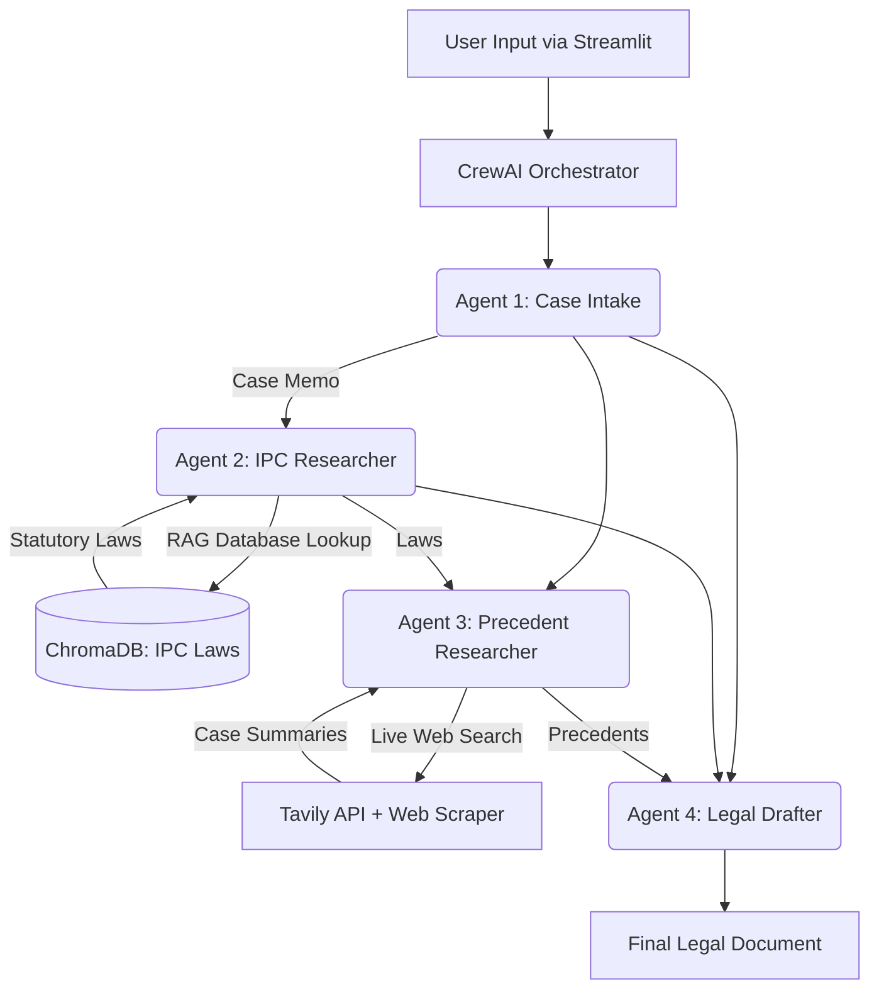

# ⚖️ Automated Legal Research & Document Drafting Engine


## 📋 Table of Contents
1. [Executive Summary](#-executive-summary)
2. [System Architecture and Data Flow](#-system-architecture-and-data-flow)
3. [The CrewAI Agentic Framework](#-the-crewai-agentic-framework)
4. [Why RAG? (The Enterprise Advantage)](#-why-rag-the-enterprise-advantage)
5. [Technology Stack](#-technology-stack)
6. [Local Development & Setup](#-local-development--setup)
7. [Security & Compliance](#-security--compliance)
8. [Contributors](#-contributors)
9. [Future Enhancements](#-future-enhancements)
10. [License](#-license)

---

## 🚀 Executive Summary
The **Automated Legal Research & Document Drafting Engine** is an enterprise-grade, multi-agent AI system designed to streamline the preliminary stages of legal counsel. 

By taking a user's unstructured natural language input regarding a legal issue, the system autonomously orchestrates a team of specialized AI agents to classify the case, retrieve exact statutory laws (Indian Penal Code), scrape the web for supporting precedent cases, and synthesize all findings into a formal, structured legal draft. This tool significantly reduces the hours traditionally spent on initial case intake and paralegal research.

---

## 🏗️ System Architecture and Data Flow

The system operates on a sequential pipeline orchestrated by CrewAI. Information is systematically gathered, refined, and passed down the chain of command.



**Data Flow Summary:**
1. **Intake:** User submits a query. Agent 1 structures it into a Case Memo.
2. **Statutory Research:** Agent 2 uses the Case Memo to query the local vector database for exact laws.
3. **Precedent Research:** Agent 3 uses the Memo and Laws to query the live web for matching court cases.
4. **Drafting:** Agent 4 receives all outputs and drafts the final document.

---

## 🤖 The CrewAI Agentic Framework

Instead of relying on a single monolithic LLM prompt, this system utilizes **CrewAI** to enforce separation of concerns. The workload is divided among four distinct "personas":

* **Case Intake Agent:** Analyzes raw input, identifies core legal issues, and outputs a structured JSON classification. (Zero tools used; pure inference).
* **IPC Section Agent:** A specialized researcher equipped with a **RAG Tool**. It translates the case memo into a semantic search query to fetch exact penal codes.
* **Legal Precedent Agent:** Equipped with the **Tavily Search API** and **ScrapeWebsiteTool**, this agent searches the live internet for relevant case law, ensuring it reads the full context of a webpage before citing it.
* **Legal Drafter Agent:** The "Senior Partner." Equipped with zero tools and a low temperature setting (T=0.3) to prevent hallucination, it synthesizes the data into a formal legal complaint.

---

## 🧠 Why RAG? (The Enterprise Advantage)

Large Language Models (LLMs) are prone to hallucinating citations and law sections. In the legal domain, absolute factual accuracy is non-negotiable. 

This project utilizes **Retrieval-Augmented Generation (RAG)** to solve this:
1.  **Grounded Truth:** The AI does not rely on its pre-trained memory for laws. It strictly retrieves data from an embedded, offline copy of the `IPC.json` database.
2.  **Semantic Search:** Using HuggingFace Embeddings, the system matches the *meaning* of the user's issue (e.g., "stolen car") to the legal terminology in the database (e.g., "Section 378: Theft").
3.  **Traceability:** Every law cited in the final document can be traced directly back to the local database, ensuring auditability.

---

## 🛠️ Technology Stack

| Component | Technology | Description |
| :--- | :--- | :--- |
| **Framework** | CrewAI | Multi-agent orchestration and task handoffs. |
| **LLM** | Llama 3 (via Groq API) | Ultra-fast inference engine for agent reasoning. |
| **Vector DB** | ChromaDB | Local storage and retrieval of embedded legal text. |
| **Embeddings** | HuggingFace | `sentence-transformers` for semantic vectorization. |
| **Web Search** | Tavily API | AI-optimized search engine for precedent retrieval. |
| **Frontend** | Streamlit | Rapid, Python-native UI generation. |

---

## 💻 Local Development & Setup

### Prerequisites
* Python 3.10+
* Groq API Key
* Tavily API Key

### Installation

1. **Clone the repository:**
   ```bash
   git clone [https://github.com/yourusername/ai-legal-assistant-crewai.git](https://github.com/yourusername/ai-legal-assistant-crewai.git)
   cd ai-legal-assistant-crewai
   ```

2. **Set up a virtual environment:**
   ```bash
   python -m venv venv
   source venv/bin/activate  # On Windows: venv\Scripts\activate
   ```

3. **Install dependencies:**
   ```bash
   pip install -r requirements.txt
   ```

4. **Environment Variables:**
   Create a `.env` file in the root directory and add your keys:
   ```env
   GROQ_API_KEY=your_groq_api_key_here
   TAVILY_API_KEY=your_tavily_api_key_here
   PERSIST_DIRECTORY_PATH=./ipc_vector_db
   IPC_COLLECTION_NAME=ipc_laws
   ```

5. **Initialize the Vector Database:**
   *You must run this once before starting the app to build the local law library.*
   ```bash
   python data_loader.py
   ```

6. **Run the Application:**
   ```bash
   streamlit run app.py
   ```

---

## 🔒 Security & Compliance

* **API Key Management:** API keys are managed locally via `python-dotenv` and are explicitly ignored in version control (`.gitignore`).
* **Disclaimer:** This application generates content for *informational and preliminary research purposes only*. It does not constitute binding legal advice. A qualified human attorney must review all generated documents before official use.

---

## 🤝 Contributors

**Lead Architect & Developer** - PUSHPANATHAN N

Contributions, issues, and feature requests are welcome!

---

## 🚀 Future Enhancements

* **Deep-Scrape Verification:** Enhance Agent 3 with a dedicated web scraper to read full court judgments rather than relying solely on search snippets (mitigating the "Snippet Trap").
* **Human-in-the-Loop (HITL):** Implement a review stage where the user can approve or reject the retrieved IPC sections before the drafter agent begins writing.
* **Multi-Jurisdiction Support:** Expand the vector database to support multiple regional laws beyond the IPC, allowing the intake agent to route the query to the correct database based on user location.

---

## 📄 License
This project is licensed under the MIT License. See the `LICENSE` file for details.
```
